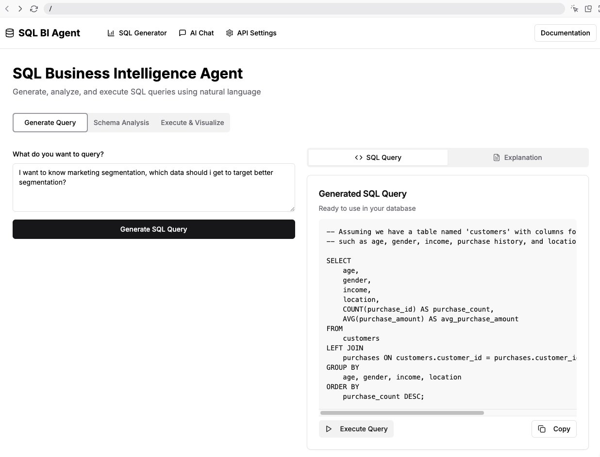

# SQL Business Intelligence Agent

A powerful AI-powered tool that helps users generate SQL queries from natural language, analyze database schemas, and visualize query results.



## Overview

The SQL Business Intelligence Agent is designed to bridge the gap between business users and database technology. It allows users to:

- Generate SQL queries using natural language
- Analyze and visualize database schemas
- Get line-by-line explanations of SQL queries
- Save and reuse previous queries
- Visualize query results with charts and tables

## How It Was Built

### 1. Project Setup and Architecture

The project was built using:

- **Next.js**: For the React framework and server-side rendering
- **TypeScript**: For type safety and better developer experience
- **Tailwind CSS**: For styling and UI components
- **shadcn/ui**: For pre-built UI components
- **AI SDK**: For integrating with various AI models
- **Recharts**: For data visualization

The application follows a modern architecture with:

- Server components and client components
- Server actions for backend functionality
- Local storage for persisting user data
- Responsive design for all device sizes

### 2. Core Features Development

#### Natural Language to SQL Conversion

The heart of the application is the ability to convert natural language to SQL:

1. **User Input**: The user describes what they want to query in plain English
2. **AI Processing**: The input is sent to an AI model (default: GPT-4o Mini)
3. **SQL Generation**: The AI generates the appropriate SQL query
4. **Explanation**: The AI provides a detailed explanation of the query
5. **Display**: The SQL and explanation are displayed to the user

This is implemented in `app/actions.ts` using the AI SDK:

```typescript
export async function generateSqlQuery(prompt: string, schema?: string) {
  // Create a system prompt that guides the model to generate SQL
  const systemPrompt = `You are an expert SQL query generator...`;

  // Generate the SQL query using the AI SDK
  const result = await generateObject({
    model: openai("gpt-4o-mini"),
    system: systemPrompt,
    prompt: `Generate a SQL query for the following request: ${prompt}`,
    schema: SqlResponseSchema,
  });

  return result.object;
}
```
